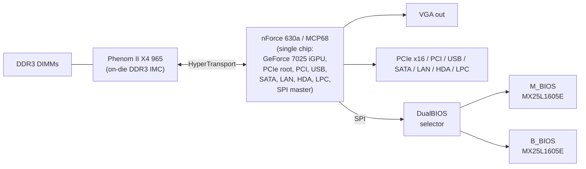

# Sinter — Agentic compute rig: Phenom II + Tang Primer 20K FPGA + ESP32 + Forth + LLM orchestration

## Support

If you find this useful, please consider buying me a coffee:

[](https://www.paypal.com/donate?hosted_button_id=Q3BESC73EWVNN&custom=sinter)

## Table of Contents

<!-- toc -->
<!-- tocstop -->

## Overview

Sinter is an agentic compute rig built around a Phenom II X4 965 (AM3) as the execution engine, a Tang Primer 20K FPGA as the memory and bus bridge, and an ESP32 as the orchestration layer.

The ESP32 accepts natural-language problem descriptions, sends them to a local LLM (via Ollama), receives Forth code in response, compiles it to x86-64, injects the binary into the Phenom II's DDR3 via the FPGA/PCIe bridge, executes it, validates the result, and iterates on failure.

## Architecture Diagram


## Repository Layout

```
sinter/
  embedded/
    esp32/      # ESP32 firmware: agentic loop, Forth-to-x86-64 compiler, orchestration
    fpga/       # HDL for Tang Primer 20K: DDR3 bridge, PCIe endpoint, SATA controller
    phenom/     # Bare-metal x86: bootloader, kernel modules, MSR tooling
  docs/
    architecture/   # draw.io source and generated SVGs
```

## GA-M68MT-S2 Board Architecture

The host board is an AMD/AM3 design, which differs from the textbook early-2000s
Intel block diagram in three important ways: the DDR3 memory controller lives
**on the CPU** (not in a northbridge); the CPU talks to the chipset over
**HyperTransport** rather than an FSB; and the **nForce 630a / MCP68 is a single
chip** that integrates the GeForce 7025 iGPU, PCIe root, PCI, USB, SATA, LAN,
HD Audio, LPC and SPI master. The board also carries Gigabyte **DualBIOS** —
two SPI flash chips on the same bus behind a small selector.



## Hardware

| Component | Role |
|---|---|
| Phenom II X4 965 (AM3 / GA-M68MT-S2) | x86-64 execution engine |
| Tang Primer 20K FPGA + DDR3 SO-DIMM | Memory bridge, PCIe endpoint, SATA/SPI controller |
| ESP32 | Orchestration, Forth compiler, Ollama client |
| ESP32-S3-CAM | Vision input for inference tasks |

## Architecture Diagrams

`docs/architecture/sinter.drawio` is the source for the diagram above.
The SVG is auto-regenerated on commit by the pre-commit hook in `.githooks/pre-commit`.

To activate the hook after cloning:

```bash
git config core.hooksPath .githooks
```

## Support

If you find this useful, please consider buying me a coffee:

[](https://www.paypal.com/donate?hosted_button_id=Q3BESC73EWVNN&custom=sinter)
