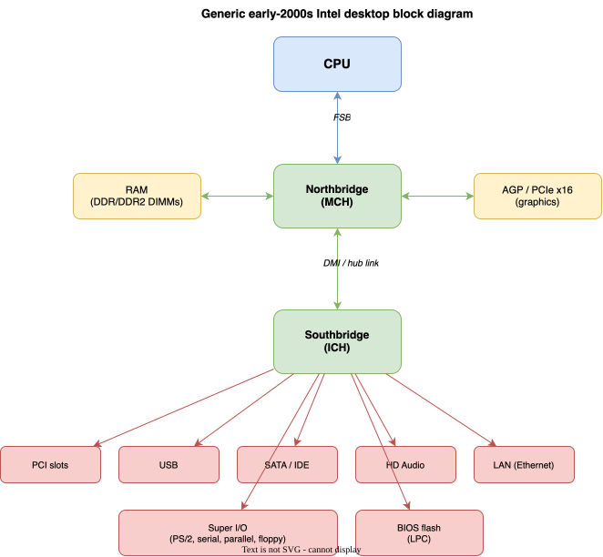
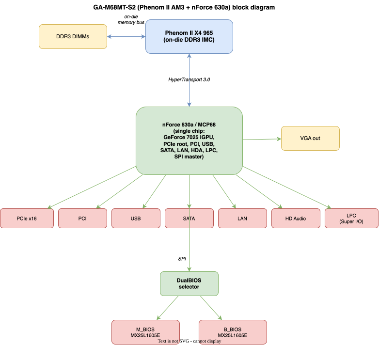

# Sinter — Combining hardware in cruel and unusual ways

## Support

If you find this useful, please consider buying me a coffee:

[](https://www.paypal.com/donate?hosted_button_id=Q3BESC73EWVNN&custom=sinter)

## Table of Contents

<!-- toc -->

- [Overview](#overview)
- [Architecture Diagram](#architecture-diagram)
- [Repository Layout](#repository-layout)
- [GA-M68MT-S2 Board Architecture](#ga-m68mt-s2-board-architecture)
- [Hardware](#hardware)
- [Architecture Diagrams](#architecture-diagrams)
- [Support](#support)

<!-- tocstop -->

## Overview

Sinter is an agentic compute rig built around a Phenom II X4 965 (AM3) as the execution engine, a Tang Primer 20K FPGA as the memory and bus bridge, and an ESP32 as the orchestration layer.

The ESP32 accepts natural-language problem descriptions, sends them to a local LLM (via Ollama), receives Forth code in response, compiles it to x86-64, injects the binary into the Phenom II's DDR3 via the FPGA/PCIe bridge, executes it, validates the result, and iterates on failure.

> ⭐⭐⭐⭐⭐ — *"Delightfully unhinged in exactly the right way"* — Copilot
>
> ⭐⭐⭐⭐⭐ — *"Slow, uncached, synchronization hell"* — ChatGPT
>
> ⭐⭐⭐⭐⭐ — *"Ambitious and cool, but genuinely tricky"* — Grok
>
> ⭐⭐⭐⭐⭐ — *"A desk of whirring salvage spending three days to say 'Hello'"* — Claude

## Architecture Diagram


## Repository Layout

```
sinter/
  embedded/
    esp32/      # ESP32 firmware: agentic loop, Forth-to-x86-64 compiler, orchestration
    fpga/       # HDL for Tang Primer 20K: DDR3 bridge, PCIe endpoint, SATA controller
    phenom/     # Bare-metal x86: bootloader, kernel modules, MSR tooling
  docs/
    architecture/   # draw.io source and generated SVGs
```

## GA-M68MT-S2 Board Architecture

For reference, the textbook early-2000s Intel desktop block diagram looks like
this:



CPU on a front-side bus to a **northbridge** (MCH) that owns RAM and AGP/PCIe×16,
then a **southbridge** (ICH) hanging off it that fans out to PCI, USB, SATA/IDE,
audio, LAN, Super I/O (PS/2, serial, parallel, floppy) and the BIOS flash. Fast
stuff close to the CPU, slow/legacy stuff one hop further out.

The Sinter host board (Gigabyte GA-M68MT-S2, Phenom II AM3, nForce 630a /
GeForce 7025) is **not** that picture. It differs in three important ways:

1. **RAM doesn't go through the chipset.** AM3 CPUs have the DDR3 memory
   controller **on-die**. The DIMM slots connect straight to the CPU.
2. **No FSB — it's HyperTransport.** The CPU↔chipset link is a HyperTransport
   3.0 point-to-point bus.
3. **No separate north/southbridge — it's one chip.** The nForce 630a / MCP68
   is a single-chip chipset: PCIe root, the integrated GeForce 7025 iGPU (the
   VGA output), PCI, USB, SATA, LAN MAC, HD Audio, LPC and the SPI master all
   in one package.

Two project-specific extras the generic diagram doesn't show:

- **BIOS is SPI, not LPC.** The MX25L1605E talks SPI to the chipset's SPI
  master — which is why a serprog rig works at all.
- **DualBIOS.** There are **two** flash chips on that SPI bus plus a small
  selector (the "DualBIOS controller").



## Hardware

| Component | Role |
|---|---|
| Phenom II X4 965 (AM3 / GA-M68MT-S2) | x86-64 execution engine |
| Tang Primer 20K FPGA + DDR3 SO-DIMM | Memory bridge, PCIe endpoint, SATA/SPI controller |
| ESP32 | Orchestration, Forth compiler, Ollama client |
| ESP32-S3-CAM | Vision input for inference tasks |

## Architecture Diagrams

`docs/architecture/sinter.drawio` is the source for the diagram above.
The SVG is auto-regenerated on commit by the pre-commit hook in `.githooks/pre-commit`.

To activate the hook after cloning:

```bash
git config core.hooksPath .githooks
```

## Support

If you find this useful, please consider buying me a coffee:

[](https://www.paypal.com/donate?hosted_button_id=Q3BESC73EWVNN&custom=sinter)
